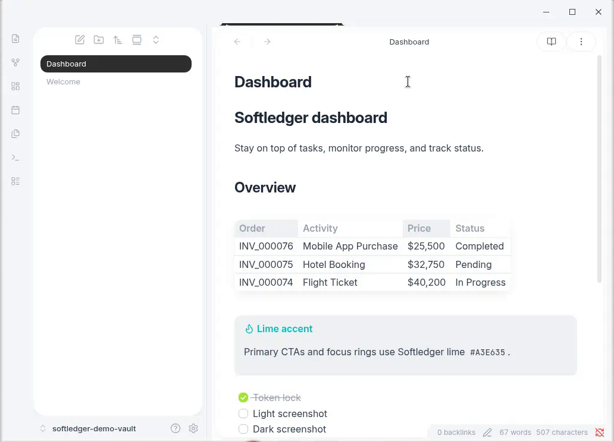
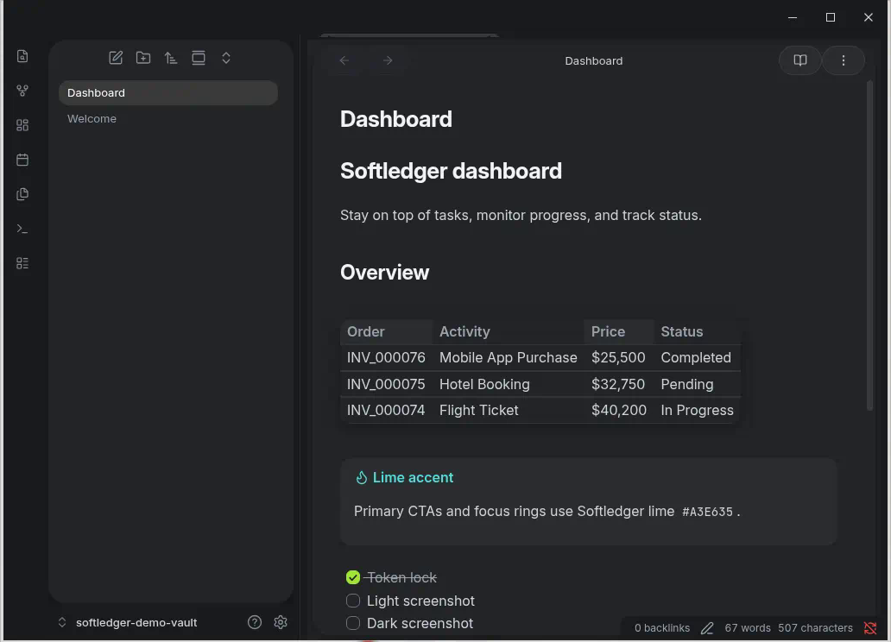
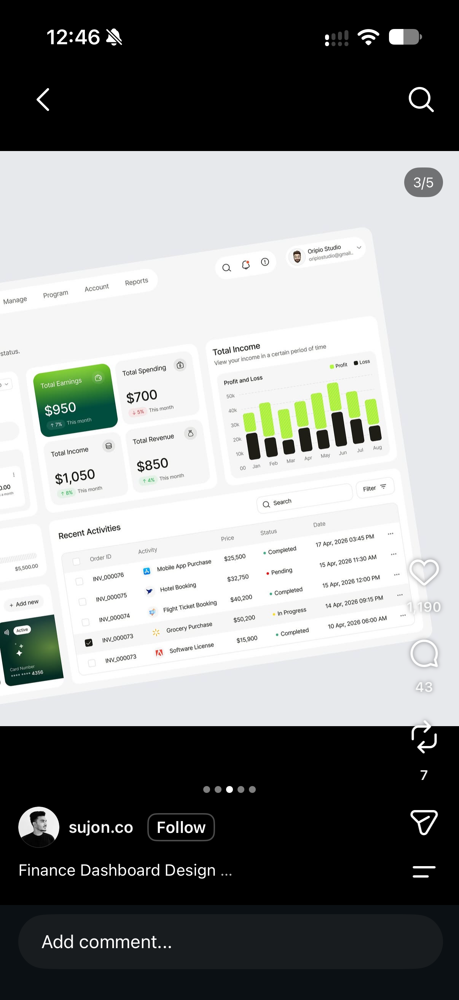
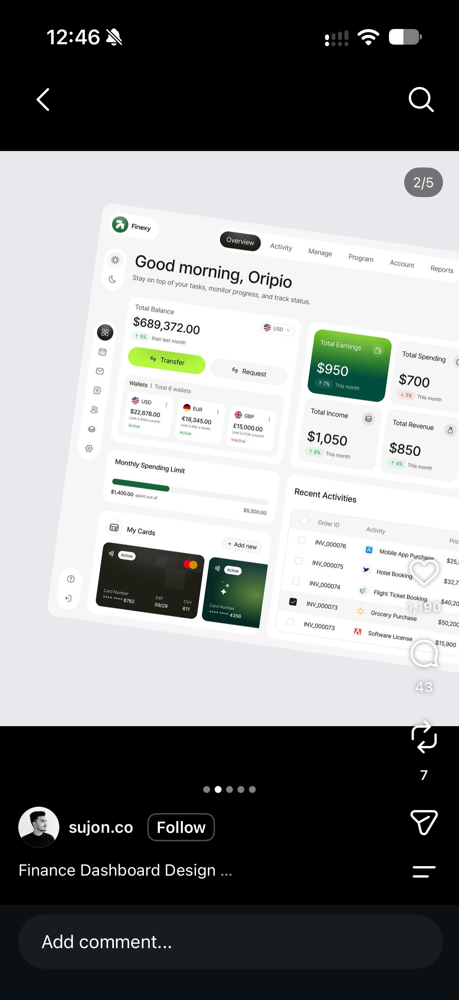
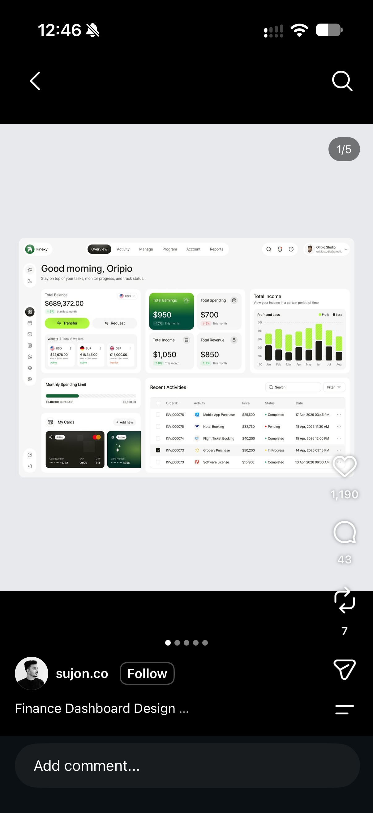

# Softledger

A lightweight [Obsidian](https://obsidian.md) community theme inspired by modern finance-dashboard soft UI — airy light-gray canvas, white floating cards, lime/acid green accents, and charcoal pill tabs.

**Author:** Ramakrishna Dhikonda · **License:** MIT

**Version:** 0.2.0 — pixel-refinement pass. Design tokens (source of truth): [`docs/TOKENS.md`](docs/TOKENS.md) (v0.2.0).

## Screenshots





## Screenshots

| Light | Dark |
| --- | --- |
|  | *(dark mode keeps soft-card language)* |
|  |  |

> Design refs: `docs/refs/`. Live vault shots: `docs/screenshots/`.

## Install

### Manual (local)

1. Open your vault’s config folder: **Settings → Community plugins → Open .obsidian folder** (or navigate to `<vault>/.obsidian/`).
2. Create `themes/Softledger/` if it does not exist:
   ```text
   .obsidian/themes/Softledger/
   ├── manifest.json
   └── theme.css
   ```
3. Copy `manifest.json` and `theme.css` from this repo into that folder.
4. In Obsidian: **Settings → Appearance → Themes** → select **Softledger**.
5. (Optional) Toggle light/dark under **Appearance → Base color scheme**.

### From a clone

```bash
git clone <this-repo> Softledger
cp Softledger/manifest.json Softledger/theme.css \
  "<vault>/.obsidian/themes/Softledger/"
```

Then enable the theme in **Settings → Appearance**.

## Design notes

Softledger maps a finance-dashboard soft-UI system onto Obsidian:

| Token / idea | Value / behavior |
| --- | --- |
| App canvas | `#F5F7F9` (light) / `#141618` (dark) |
| Cards / panels | `#FFFFFF` / `#1E2124`, radius 20px (xl) |
| Accent | Lime `#A3E635` — CTAs, focus, positive |
| Active tabs | Charcoal `#1A1A1A` **pill** + white text (light) |
| Depth | Soft diffused shadows over hard borders |
| Type | Inter / system UI via `--font-interface` / `--font-text` |
| Ribbon | Narrow, blended into canvas; active icon as pill/circle |

**Key CSS variables** (theme-owned `--sl-*`, mapped to Obsidian tokens):

- `--sl-app-bg`, `--sl-surface`, `--sl-surface-elevated`
- `--sl-accent`, `--sl-accent-hover`, `--sl-accent-soft`
- `--sl-pill-bg` / `--sl-pill-text` (active charcoal pill)
- `--sl-text`, `--sl-text-secondary`, `--sl-text-muted`
- `--sl-success` / `--sl-warning` / `--sl-danger`
- `--sl-shadow-sm|md|lg`, `--sl-radius-sm|md|lg|xl|pill`
- See `docs/TOKENS.md` for the full token sheet

Obsidian mappings include `--background-primary|secondary`, `--interactive-accent`, `--text-*`, `--nav-item-*`, `--ribbon-background`, tab radii, and modal radii.

## Performance

- Pure CSS — no build step, no background images, no base64 blobs
- Lean selector set; no expensive universal `*` rules
- Target size well under ~80KB (`theme.css` ~36KB in v0.2.0)

## Structure

```text
obsidian-softledger/
├── manifest.json
├── theme.css
├── versions.json
├── README.md
├── LICENSE
└── docs/
    ├── .gitkeep
    └── refs/          # UI reference images
```

## Compatibility

- `minAppVersion`: **1.5.0**
- Desktop & mobile (CSS-only theme)

## License

MIT © Ramakrishna Dhikonda — see [LICENSE](LICENSE).
