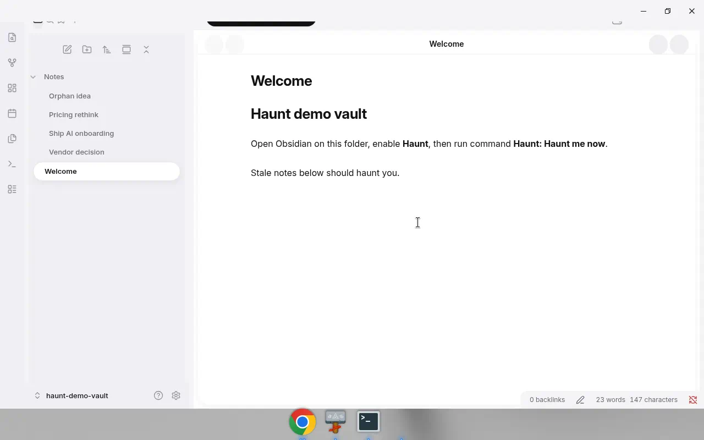
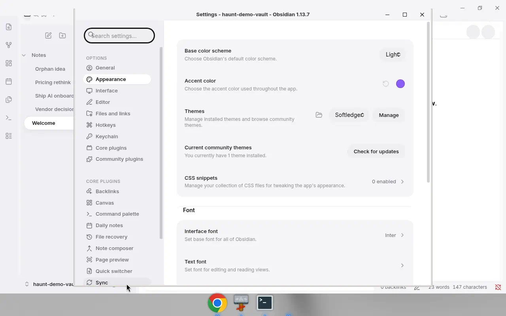
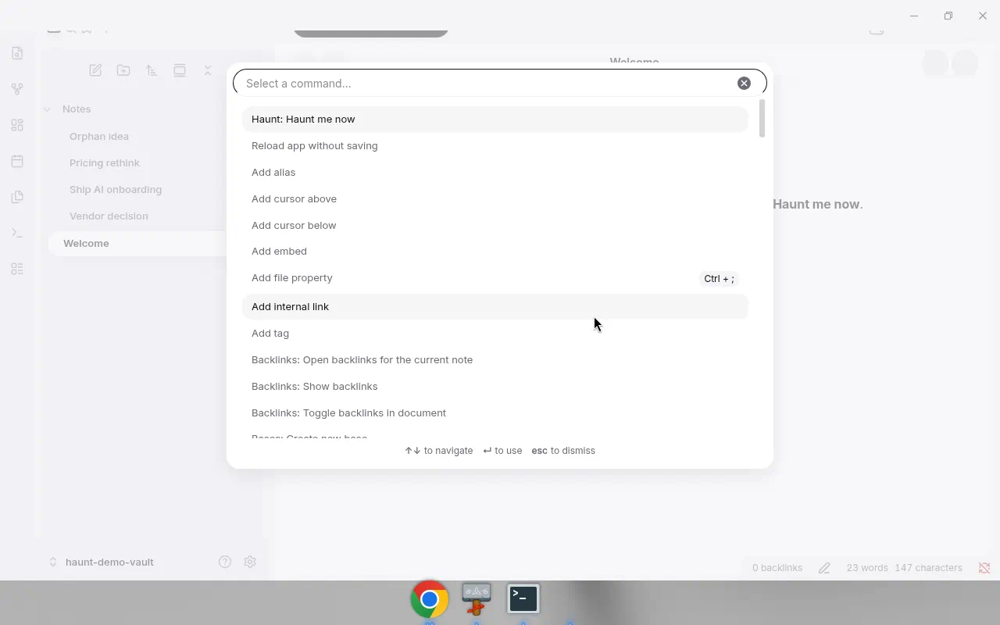

# Softledger

A lightweight [Obsidian](https://obsidian.md) community theme inspired by **education / schedule soft UI** — airy light canvas, lavender-tint sidebar, **white active nav pills**, **black solid primary pills**, and soft pastel cards.

**Author:** Ramakrishna Dhikonda · **License:** MIT

**Version:** 1.1.0 — strict token system + visual fidelity pass against `docs/refs/v3`. White nav / black primary pills; no lime.

Design tokens: [`docs/TOKENS.md`](docs/TOKENS.md) · Visual spec: [`docs/VISUAL_SPEC.md`](docs/VISUAL_SPEC.md)

## Screenshots (v1 education SoT)

White active nav pills, black accents, soft surfaces:








## Install

### Manual (local)

1. Open your vault’s config folder: **Settings → Community plugins → Open .obsidian folder** (or `<vault>/.obsidian/`).
2. Create `themes/Softledger/` if needed:
   ```text
   .obsidian/themes/Softledger/
   ├── manifest.json
   └── theme.css
   ```
3. Copy `manifest.json` and `theme.css` from this repo into that folder.
4. In Obsidian: **Settings → Appearance → Themes** → select **Softledger**.
5. (Optional) Toggle light/dark under **Appearance → Base color scheme**.

### From a clone

```bash
git clone <this-repo> Softledger
cp Softledger/manifest.json Softledger/theme.css \
  "<vault>/.obsidian/themes/Softledger/"
```

## Design notes

| Token / idea | Value / behavior |
| --- | --- |
| App canvas | `#F4F4F7` (light) / `#1A1B1F` (dark) |
| Sidebar | Soft lavender-gray `#F0EFF5` |
| Main / cards | White `#FFFFFF`, radius 24px, subtle border + soft shadow |
| **Active nav** | **White pill** + dark text |
| **Primary / tabs / CTA** | **Black solid pill** `#111111` + white text |
| Inactive pills | Light gray `#EEEEF0` + thin `#EEEEEE` border |
| Pastels | Lavender / blue / mint / peach / coral |
| Links | Soft indigo `#5B5BD6` (not lime) |
| Type | Inter / system UI |
| Badges | Black circles, white text |

**Key CSS variables** (`--sl-*`):

- `--sl-app-bg`, `--sl-sidebar-bg`, `--sl-surface`, `--sl-surface-alt`
- `--sl-pill-bg` / `--sl-pill-text` (black primary)
- `--sl-nav-active-bg` / `--sl-nav-active-text` (white nav pill)
- `--sl-pastel-*`, `--sl-link`, `--sl-text*`
- `--sl-shadow-sm|md|lg`, `--sl-radius-sm|md|lg|xl|2xl|pill`
- `--sl-inactive-pill-*`, `--sl-text-disabled`, `--sl-focus-shadow`

See `docs/TOKENS.md` and `docs/VISUAL_SPEC.md`.

## Known limitations

Obsidian CSS cannot fully recreate the ref mockups:

- Multi-column schedule grids, current-time black line, and floating pastel FABs are app chrome, not themeable 1:1
- Calendar day cells / attendance charts depend on plugins or note content
- Graph & canvas only expose limited CSS variables
- Outer “floating window” 32–40px OS rounding is not controllable from a theme
- Notification badge circles apply where Obsidian exposes count flair (`.nav-file-tag`, `.tree-item-flair`), not arbitrary nav labels

Within those constraints, chrome (ribbon, sidebars, tabs, explorer, editor, modals, settings) follows the v3 visual language.

## Performance

- Pure CSS — no build step, no background images, no base64
- Tokens-first; lean selectors; no expensive universal `*` rules
- Target size well under ~80KB

## Structure

```text
obsidian-softledger/
├── manifest.json
├── theme.css
├── versions.json
├── README.md
├── LICENSE
└── docs/
    ├── VISUAL_SPEC.md
    ├── TOKENS.md
    ├── refs/v3/       # Source-of-truth screenshots
    └── screenshots/
```

## Compatibility

- `minAppVersion`: **1.5.0**
- Desktop & mobile (CSS-only theme)

## License

MIT © Ramakrishna Dhikonda — see [LICENSE](LICENSE).
